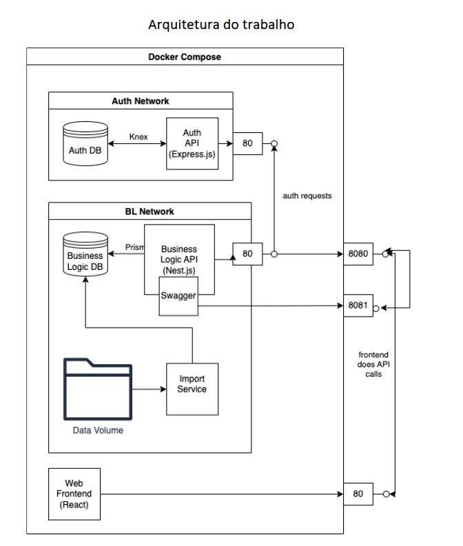

# Trabalho Prático de Sistemas Distribuidos #

### Introdução ###

Este trabalho prático desenvolveu-se durante a epoca especial do ano letivo de 2023-24

E consiste nos alunos criar um serviço distribuido escalável utilizando o
[seguinte codigo fonte](https://bitbucket.org/luisteofilo/sd/ 'Repositorio Bitbucket Com Codigo')

O dataset utilizado para desenvolver o projeto e unico para cada aluno e 
destribuido na plataforma elearning.ipvc

### Desenvolvimento ###

O projeto consiste em varios componentes containerisados utilizando docker e 
segue a seguinte arquitetura: 

<foreignObject>
    

        
        
Arquitetura do trabalho

    

     
</foreignObject>

Como demonstra na figura acima o serviço contitui em 3 componentes.
- 2 componentes backend
- 1 componente frontend

Os componentes backend estão devididos com redes internas definidas com um ficheiro ".env"
durante o processo de build dos Containers.

A Frontend interage com a Backend com um api REST e documentado com swagger

A Backend processa os requests a BL Network valida e processa o request, a Auth Network
verifica a autorização 

#### _TPSI @ipvc/estg, 2023-2024_ ####
